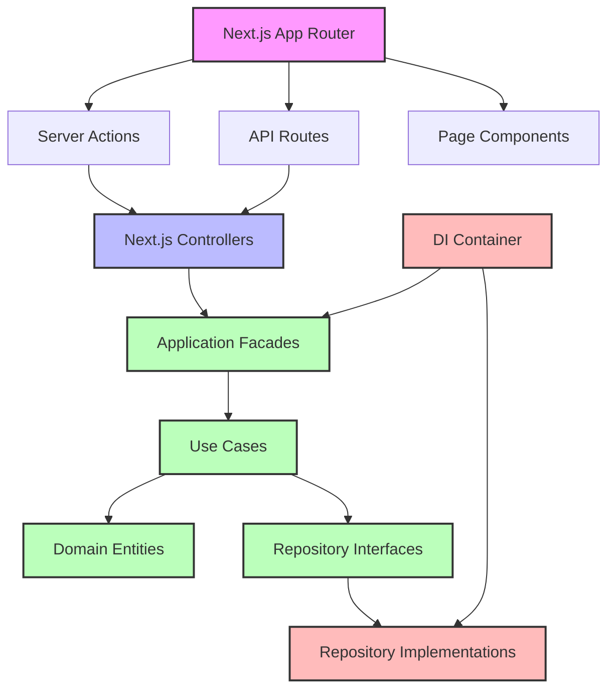

# Comprehensive Implementation Plan: App Directory References src/

This approach maintains the Next.js App Router structure while leveraging the CLEAN architecture in the `src/` directory. It provides a clean separation of concerns while allowing for an incremental migration path.

## Phase 1: Setup and Configuration

### 1.1 Update Path Aliases in tsconfig.json

Ensure your path aliases are properly configured to make imports cleaner:

```json
{
  "compilerOptions": {
    "paths": {
      "@/*": ["./*"],
      "@/src/*": ["./src/*"],
      "@/app/*": ["./app/*"],
      "@/components/*": ["./components/*"]
    }
  }
}
```

### 1.2 Create DI Container Initialization

Create a file to initialize the DI container at application startup:

```typescript
// app/di-setup.ts
import { container } from '@/src/infrastructure/di/container';
import { LeagueFacade } from '@/src/application-facade/implementations/league.facade';
import { SeriesFacade } from '@/src/application-facade/implementations/series.facade';
import { setLeagueFacade } from '@/src/presentation/adapters/nextjs/controllers/league.controller';
import { setSeriesFacade } from '@/src/presentation/adapters/nextjs/controllers/series.controller';

// Initialize facades with repositories from container
const leagueFacade = new LeagueFacade(
  container().leagueRepository,
  container().authService
);

const seriesFacade = new SeriesFacade(
  container().seriesRepository,
  container().authService
);

// Set facades in controllers
setLeagueFacade(leagueFacade);
setSeriesFacade(seriesFacade);

export { container };
```

### 1.3 Import DI Setup in Root Layout

Import the DI setup in your root layout to ensure it's initialized on application startup:

```typescript
// app/layout.tsx
import './di-setup';
import type React from "react";
import type { Metadata } from "next";
// ... rest of your imports

export default function RootLayout({
  children,
}: {
  children: React.ReactNode;
}) {
  // ... rest of your component
}
```

## Phase 2: Migrate Server Actions

### 2.1 Update League Actions

```typescript
// app/__actions/league.ts
"use server"

import { revalidatePath } from "next/cache";
import { 
  createLeague, 
  updateLeague, 
  deleteLeague, 
  getLeagues, 
  getLeague,
  searchLeagues
} from "@/src/presentation/adapters/nextjs/controllers/league.controller";

// Export controller methods directly
export { createLeague, updateLeague, deleteLeague, getLeague, searchLeagues };

// Wrap methods that need revalidation
export async function getLeaguesWithRevalidation() {
  const result = await getLeagues();
  revalidatePath("/leagues");
  return result;
}

export async function createLeagueWithRevalidation(formData: FormData) {
  const result = await createLeague(formData);
  if (result.success) {
    revalidatePath("/leagues");
  }
  return result;
}

export async function updateLeagueWithRevalidation(id: string, formData: FormData) {
  const result = await updateLeague(id, formData);
  if (result.success) {
    revalidatePath("/leagues");
    revalidatePath(`/leagues/${id}`);
  }
  return result;
}

export async function deleteLeagueWithRevalidation(id: string, userId: string) {
  const result = await deleteLeague(id, userId);
  if (result.success) {
    revalidatePath("/leagues");
  }
  return result;
}
```

### 2.2 Update Series Actions

```typescript
// app/__actions/series.ts
"use server"

import { revalidatePath } from "next/cache";
import {
  createSeries,
  updateSeries,
  deleteSeries,
  getSeries,
  getAllSeries
} from "@/src/presentation/adapters/nextjs/controllers/series.controller";

// Export controller methods directly
export { createSeries, updateSeries, deleteSeries, getSeries };

// Wrap methods that need revalidation
export async function getAllSeriesWithRevalidation() {
  const result = await getAllSeries();
  revalidatePath("/series");
  return result;
}

// ... similar pattern for other actions that need revalidation
```

### 2.3 Update Players Actions

Follow the same pattern for all other server actions:

```typescript
// app/__actions/players.ts
"use server"

import { revalidatePath } from "next/cache";
// Import from player controller (you'll need to create this)
import {
  createPlayer,
  updatePlayer,
  getPlayer,
  searchPlayers
} from "@/src/presentation/adapters/nextjs/controllers/player.controller";

// Export and wrap methods as needed
// ...
```

## Phase 3: Create Missing Controllers

### 3.1 Create Player Controller

```typescript
// src/presentation/adapters/nextjs/controllers/player.controller.ts
import { IPlayerFacade } from '@/src/application-facade/interfaces/IPlayerFacade';
import { 
  CreatePlayerDTO, 
  UpdatePlayerDTO, 
  PlayerSearchDTO 
} from '@/src/core/application/dtos/player.dto';

// This will be injected via DI
let playerFacade: IPlayerFacade;

export function setPlayerFacade(facade: IPlayerFacade) {
  playerFacade = facade;
}

export async function createPlayer(formData: FormData) {
  try {
    const data: CreatePlayerDTO = {
      name: formData.get('name') as string,
      email: formData.get('email') as string,
      // ... other fields
    };

    return await playerFacade.createPlayer(data);
  } catch (error) {
    console.error('Error creating player:', error);
    return { success: false, error: 'Failed to create player' };
  }
}

// ... other controller methods
```

### 3.2 Create Other Missing Controllers

Follow the same pattern for all other entities that need controllers:
- Tournament controller
- Season controller
- Qualification controller
- Scoreboard controller

## Phase 4: Update Facade Implementations in DI Container

### 4.1 Update Container with All Facades

```typescript
// src/infrastructure/di/container.ts

// Add imports for all facades and repositories
import { IPlayerFacade } from '@/src/application-facade/interfaces/IPlayerFacade';
import { PlayerFacade } from '@/src/application-facade/implementations/player.facade';
// ... other imports

export class DIContainer {
  // ... existing code

  // Add facade properties
  private _playerFacade: IPlayerFacade | null = null;
  // ... other facades

  // Add facade getters
  get playerFacade(): IPlayerFacade {
    if (!this._playerFacade) {
      this._playerFacade = new PlayerFacade(
        this.playerRepository,
        this.authService
      );
    }
    return this._playerFacade;
  }

  // ... other facade getters

  // Update reset method
  reset(): void {
    // ... existing reset code
    this._playerFacade = null;
    // ... reset other facades
  }
}
```

### 4.2 Update DI Setup to Initialize All Facades

```typescript
// app/di-setup.ts
import { container } from '@/src/infrastructure/di/container';
import { setPlayerFacade } from '@/src/presentation/adapters/nextjs/controllers/player.controller';
// ... other imports

// Initialize all facades
setPlayerFacade(container().playerFacade);
// ... set other facades

export { container };
```

## Phase 5: Update Page Components

### 5.1 Update League Pages

```typescript
// app/(root)/leagues/page.tsx
import { getLeaguesWithRevalidation } from '@/app/__actions/league';

export default async function LeaguesPage() {
  const { success, data, error } = await getLeaguesWithRevalidation();
  
  if (!success) {
    return <div>Error: {error}</div>;
  }
  
  // Render leagues using data
  return (
    // ... your JSX
  );
}
```

### 5.2 Update Other Pages

Follow the same pattern for all other pages that need to use the CLEAN architecture.

## Phase 6: Create Missing Facades and Interfaces

### 6.1 Create Player Facade Interface

```typescript
// src/application-facade/interfaces/IPlayerFacade.ts
import { 
  CreatePlayerDTO, 
  UpdatePlayerDTO, 
  PlayerDTO, 
  PlayerSearchDTO 
} from '@/src/core/application/dtos/player.dto';

export interface IPlayerFacade {
  createPlayer(data: CreatePlayerDTO): Promise<{ success: boolean; data?: PlayerDTO; error?: string }>;
  updatePlayer(data: UpdatePlayerDTO): Promise<{ success: boolean; data?: PlayerDTO; error?: string }>;
  getPlayer(id: string): Promise<{ success: boolean; data?: PlayerDTO; error?: string }>;
  searchPlayers(search: PlayerSearchDTO): Promise<{ success: boolean; data?: PlayerDTO[]; error?: string }>;
  // ... other methods
}
```

### 6.2 Create Player Facade Implementation

```typescript
// src/application-facade/implementations/player.facade.ts
import { IPlayerFacade } from '@/src/application-facade/interfaces/IPlayerFacade';
import { 
  CreatePlayerDTO, 
  UpdatePlayerDTO, 
  PlayerDTO, 
  PlayerSearchDTO 
} from '@/src/core/application/dtos/player.dto';
import { IPlayerRepository } from '@/src/core/domain/repositories/player.repository';
import { IAuthService } from '@/src/infrastructure/services/amplify-auth.service';
import { Player } from '@/src/core/domain/entities/player';

export class PlayerFacade implements IPlayerFacade {
  constructor(
    private readonly playerRepository: IPlayerRepository,
    private readonly authService: IAuthService
  ) {}

  // Implement interface methods
  async createPlayer(data: CreatePlayerDTO): Promise<{ success: boolean; data?: PlayerDTO; error?: string }> {
    try {
      // Implementation
    } catch (error) {
      // Error handling
    }
  }

  // ... other methods
}
```

### 6.3 Create Other Missing Facades

Follow the same pattern for all other entities that need facades.

## Phase 7: API Routes Integration

### 7.1 Update API Routes to Use Controllers

```typescript
// app/api/leagues/route.ts
import { NextRequest, NextResponse } from 'next/server';
import { getLeagues, searchLeagues } from '@/src/presentation/adapters/nextjs/controllers/league.controller';

export async function GET(request: NextRequest) {
  const searchParams = request.nextUrl.searchParams;
  const searchTerm = searchParams.get('search');
  
  if (searchTerm) {
    const result = await searchLeagues({ searchTerm });
    return NextResponse.json(result);
  }
  
  const result = await getLeagues();
  return NextResponse.json(result);
}
```

### 7.2 Update Other API Routes

Follow the same pattern for all other API routes.

## Phase 8: Testing and Validation

### 8.1 Create Integration Tests

```typescript
// src/presentation/adapters/nextjs/controllers/__tests__/league.controller.test.ts
import { createLeague, getLeagues } from '../league.controller';
import { setLeagueFacade } from '../league.controller';
import { LeagueFacade } from '@/src/application-facade/implementations/league.facade';

// Mock dependencies
const mockLeagueRepository = {
  create: jest.fn(),
  findAll: jest.fn(),
  // ... other methods
};

const mockAuthService = {
  getCurrentUserId: jest.fn(),
  hasRole: jest.fn(),
  // ... other methods
};

describe('League Controller', () => {
  beforeEach(() => {
    // Setup facade with mocked dependencies
    const leagueFacade = new LeagueFacade(
      mockLeagueRepository as any,
      mockAuthService as any
    );
    setLeagueFacade(leagueFacade);
    
    // Reset mocks
    jest.clearAllMocks();
  });
  
  test('createLeague should create a league', async () => {
    // Test implementation
  });
  
  // ... other tests
});
```

### 8.2 Validate End-to-End Flow

Create a test script to validate the entire flow from UI to domain layer and back.

## Phase 9: Documentation and Knowledge Transfer

### 9.1 Update Architecture Documentation

Create or update documentation explaining the architecture and how Next.js integrates with the CLEAN architecture.

### 9.2 Create Developer Guidelines

Create guidelines for developers on how to add new features following the CLEAN architecture pattern.

## Implementation Timeline

1. **Phase 1 (Setup and Configuration)**: 1 day
2. **Phase 2 (Migrate Server Actions)**: 2-3 days
3. **Phase 3 (Create Missing Controllers)**: 2-3 days
4. **Phase 4 (Update Facade Implementations)**: 1-2 days
5. **Phase 5 (Update Page Components)**: 3-4 days
6. **Phase 6 (Create Missing Facades)**: 2-3 days
7. **Phase 7 (API Routes Integration)**: 1-2 days
8. **Phase 8 (Testing and Validation)**: 2-3 days
9. **Phase 9 (Documentation)**: 1-2 days

**Total Estimated Time**: 15-23 days (can be done incrementally)

## Architecture Diagram


